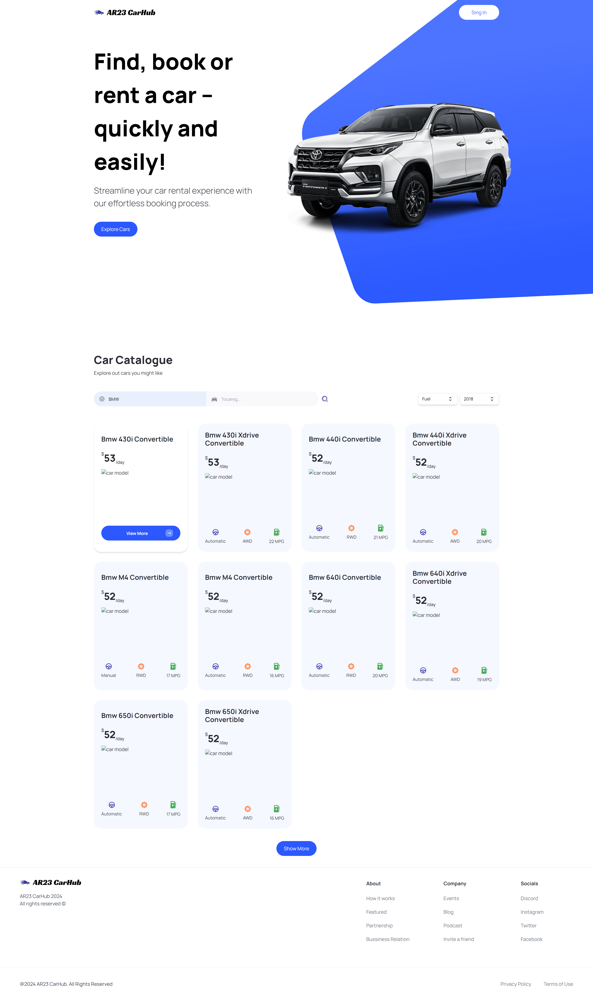
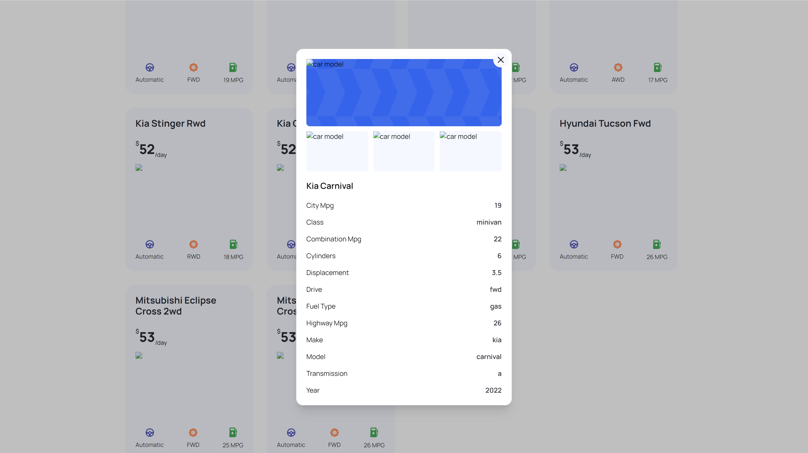

# Car Shocase React Website - Next.js + TypeScript + Tailwind CSS

Modern Next.js Application

### Screenshots




## Getting Started

- Clone repository and `cd` into it
- In the `utils/index.ts` file, change the API keys as follows:

```text
'X-RapidAPI-Key': YOUR_X-RapidAPI-Key,
'X-RapidAPI-Host': YOUR_X-RapidAPI-Host,

url.searchParams.append('customer', YOUR_API_KEY);
```

- Install the dependencies and run the dev server

```bash
npm i
npm run dev
```

- Open [localhost:3000](http://localhost:3000) to view the app in the browser

## Resources

- [Cars by API-Ninjas](https://rapidapi.com/apininjas/api/cars-by-api-ninjas/)
- [Car images API](https://www.imagin.studio/solutions/api)
> Achtung!: Car images API doesn't work in Russia
